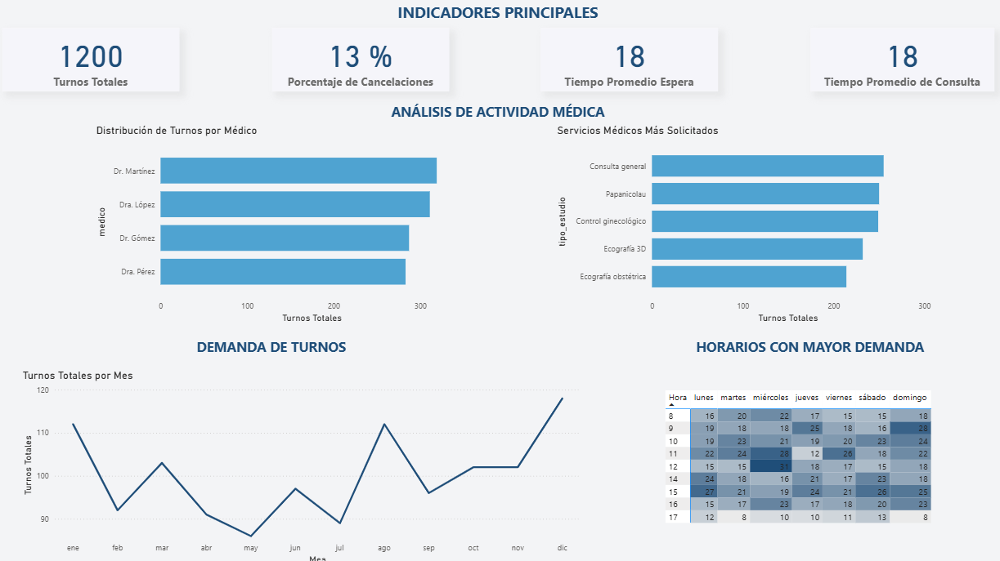
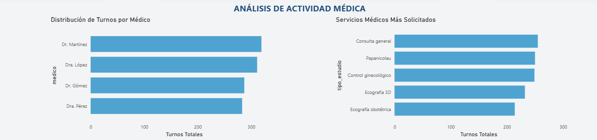
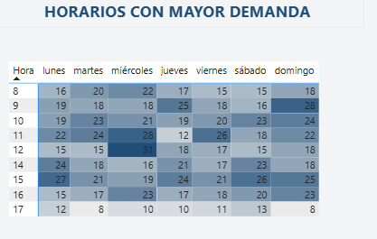

# 📊 Medical Appointments Analysis – Power BI Dashboard

## 📌 Project Overview
This project analyzes medical appointment data using Power BI in order to identify patterns in patient demand, service usage and peak appointment hours.

The dashboard provides insights that can help improve scheduling efficiency and resource allocation.

---

## 🗂 Dataset

The dataset simulates the operation of a medical practice and includes **1200 appointments**.

Key fields include:

- appointment date and time
- doctor
- type of consultation
- appointment status
- waiting time
- consultation duration
- insurance provider

---

## 📊 Dashboard

### Overview

### Medical activity analysis

### Peak demand hours

---

## 🔎 Key Insights

- A total of **1200 appointments** were recorded in the analyzed period.
- The **cancellation rate is 13%**, indicating potential opportunities to improve attendance.
- Workload distribution among doctors is relatively balanced.
- General consultations and gynecological exams represent the most requested services.
- Peak demand occurs between **9 AM and 12 PM**.

---

## 🛠 Tools Used

- Power BI
- DAX
- Power Query
- Data Visualization

---

## 👩‍💻 Author

Cecilia Marasco
